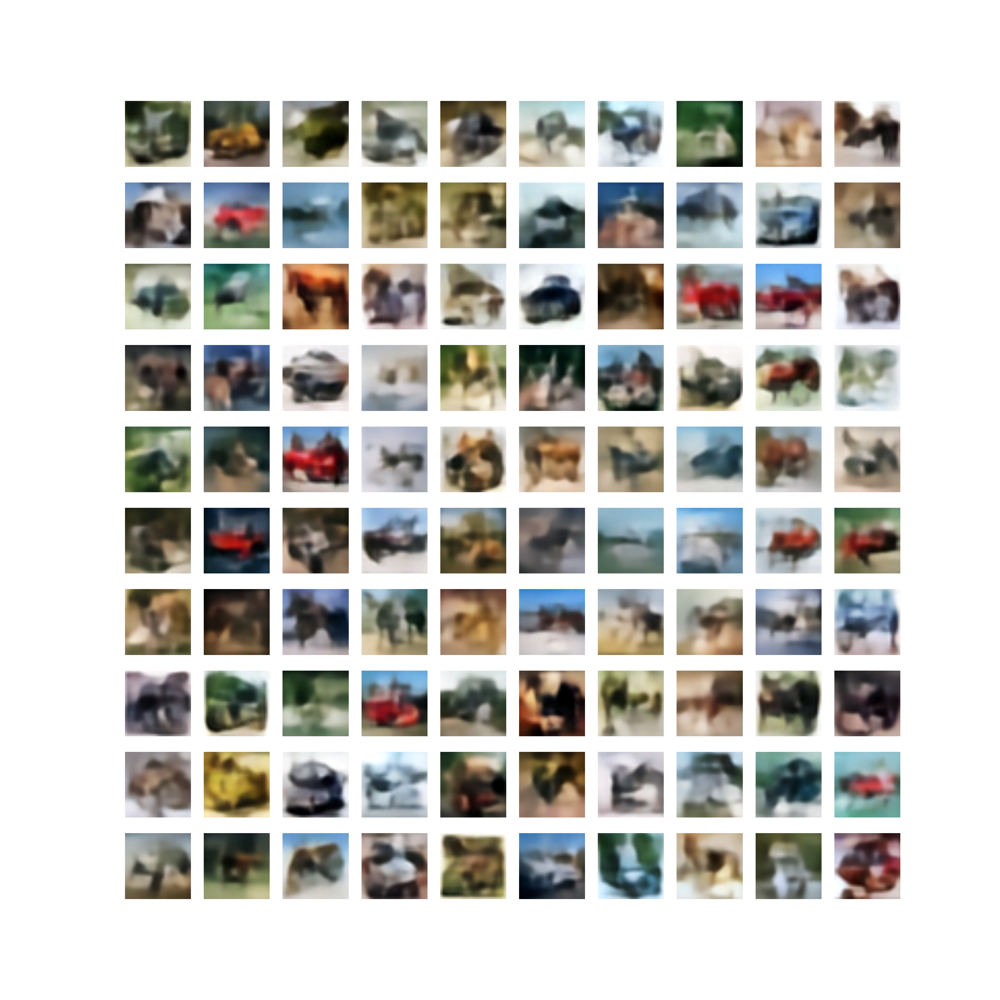
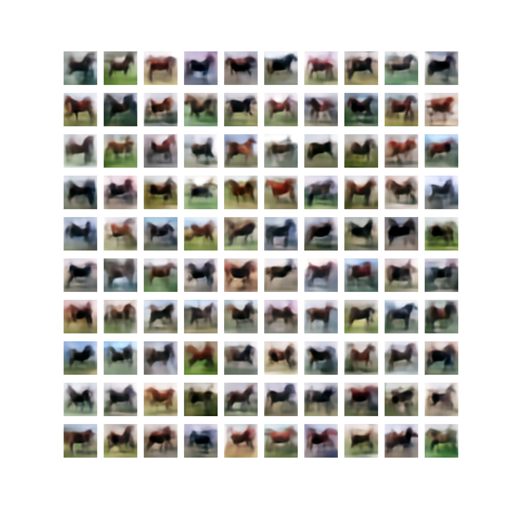
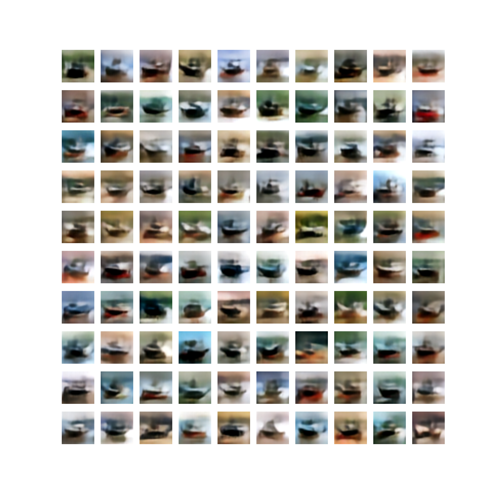
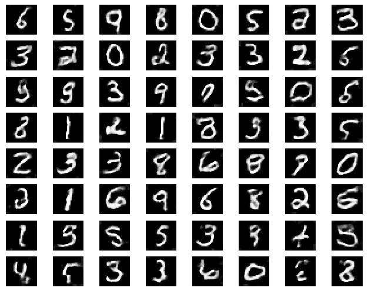
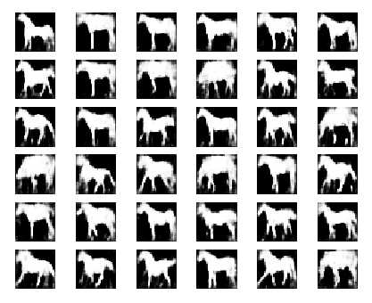

# Image Generation with Deep Boltzmann Machine and (Variational) Autoencoders

### Overview

A reseach project trying to scale up deep bolzmann machine for realistic image generation.

This repo currently implements:

1. RBM+Autoencoder model with RBM to model distribution on encoded latent space.
2. RBM+VAE model with RBM to model posterior mean for decoder.
3. Deep convolutional autoencoder, deep residual network and deep residual autoencoder in Keras.
4. Deep convolutional variational autoencoder in Keras.
5. Deep Boltzmann machine in Tensorflow.
6. Deep restricted Bolztmann network, a simple method to stack multiple RBMs for better image generation and feature extraction, in Tensorflow. [Technical report](https://arxiv.org/pdf/1611.07917v1.pdf)
7. RBM, Gaussian-Binary RBM, Convolutional RBM, Gaussian-Binary ConvRBM in Tensorflow.

### Sampled Images

RBM+VAE, (both trained on entire cifar-10)

***

VAE trained on entire cifar-10 while RBM trained on a specific class (horse and ship)

:racehorse:

:sailboat:

***

RBM + Autoencoder

***

Convolutional deep restricted Bolztmann network

1. Mnist

2. Weizmann Horse

